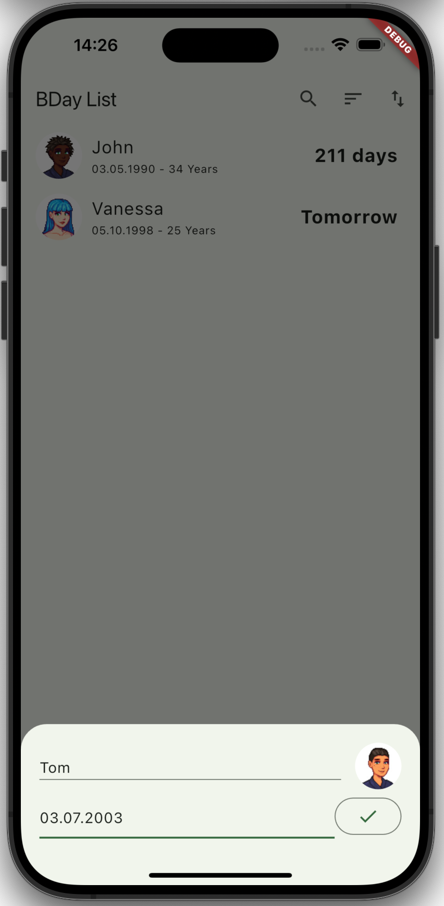

# BDay
My first Flutter App to learn some fundamentals and to play around.
That means it might be buggy.

This App is aimed to help people to remember birthdays.

## Supported Platform
| Platform | Supported |
|----------|-----------|
| iOS      | ✅        |
| Android  | ✅        |
| Windows  | ❌        |
| macOS    | ❌        |
| Linux    | ❌        |

<table style="width: 100%; table-layout: fixed;">
  <tr>
    <th style="width: 20%;">Home (iOS)</th>
    <th style="width: 20%;">Home (Android)</th>
    <th style="width: 20%;">Add</th>
    <th style="width: 20%;">Edit</th>
    <th style="width: 20%;">Import/Export</th>
  </tr>
  <tr>
    <td style="width: 20%;"></td>
    <td style="width: 20%;"></td>
    <td style="width: 20%;"></td>
    <td style="width: 20%;"></td>
    <td style="width: 20%;"></td>
  </tr>
  <tr>
    <td style="width: 20%;">iOS</td>
    <td style="width: 20%;">Android</td>
    <td style="width: 20%;">Add new entries.</td>
    <td style="width: 20%;">Edit or remove by long press.</td>
    <td style="width: 20%;">Import or export the list. Click on the arrows in the top-right corner.</td>
  </tr>
</table>
