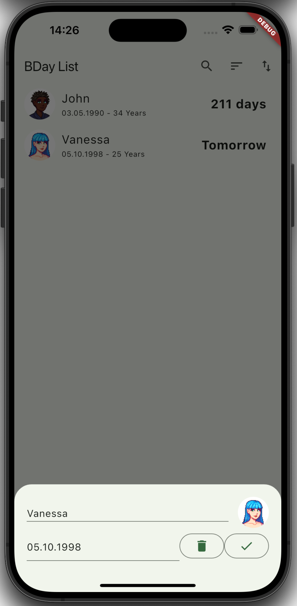

# BDay
My first Flutter App to learn some fundamentals and to play around.
That means it might be buggy.

This App is aimed to help people to remember birthdays.

## Supported Platform
| Platform | Supported |
|----------|-----------|
| iOS      | ✅        |
| Android  | ✅        |
| Windows  | ❌        |
| macOS    | ❌        |
| Linux    | ❌        |

## Features

<table style="width: 100%; table-layout: fixed;">
  <tr>
    <th style="width: 15%;">Home</th>
    <th style="width: 15%;">Add</th>
    <th style="width: 15%;">Edit</th>
    <th style="width: 15%;">Search</th>
    <th style="width: 15%;">Sort</th>
    <th style="width: 15%;">Import/Export</th>
  </tr>
  <tr>
    <td style="width: 15%;"></td>
    <td style="width: 15%;"></td>
    <td style="width: 15%;"></td>
    <td style="width: 15%;"></td>
    <td style="width: 15%;"></td>
    <td style="width: 15%;"></td>
  </tr>
  <tr>
    <td style="width: 15%;">Shows added birthdays.</td>
    <td style="width: 15%;">Add entry.</td>
    <td style="width: 15%;">Edit or remove entries.</td>
    <td style="width: 15%;">Search by name.</td>
    <td style="width: 15%;">Sort list by attributes.</td>
    <td style="width: 15%;">Export and import your list.</td>
  </tr>
</table>
